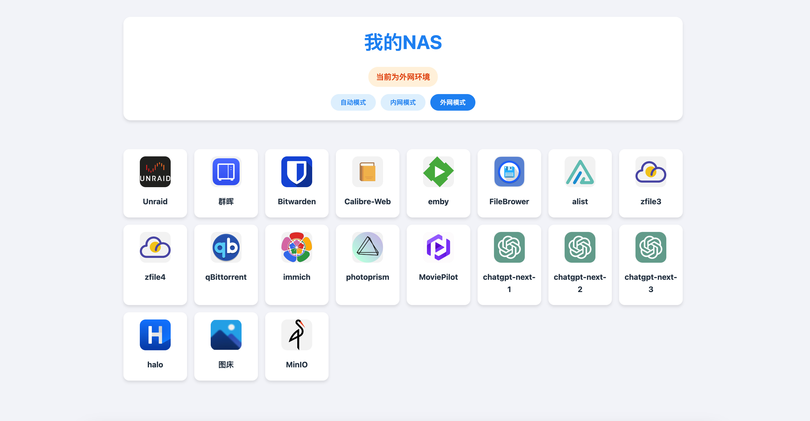
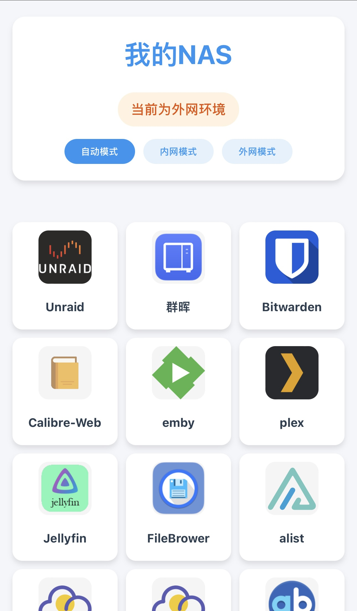

# nav-lite

A lightweight navigation page, perfect for NAS and personal website navigation.

## Features

- Simple and clean interface
- Responsive design (PC & Mobile friendly)
- Easy to customize using JSON configuration
- No backend required, pure frontend implementation

## Quick Start

1. Download or clone the repository
2. Modify `data.json` to customize your navigation links
3. Open `index.html` in your browser

## Screenshots

### Desktop View

### Mobile View

---

# nav-lite [中文]

一个轻量级的导航页面，特别适合 NAS 和个人网站导航使用。

## 特点

- 界面简洁清晰
- 响应式设计（同时支持电脑和手机）
- 使用 JSON 配置，易于自定义
- 纯前端实现，无需后端

## 快速开始

1. 下载或克隆本仓库
2. 修改 `data.json` 文件以自定义导航链接
3. 在浏览器中打开 `index.html`

## 界面预览

### 电脑端

### 手机端

